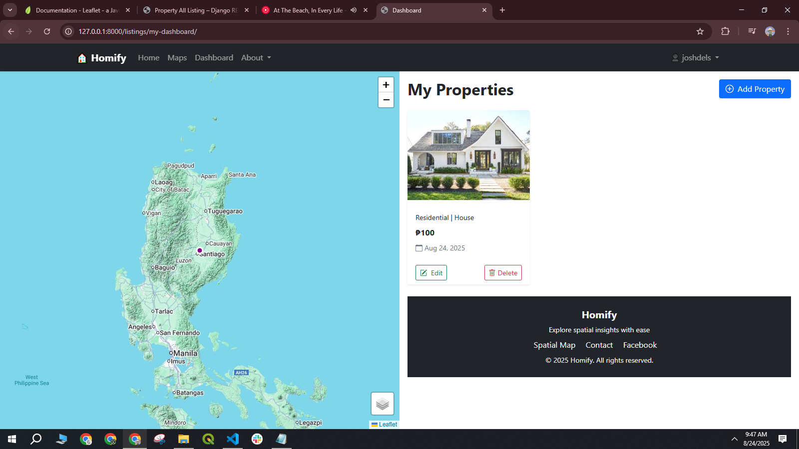
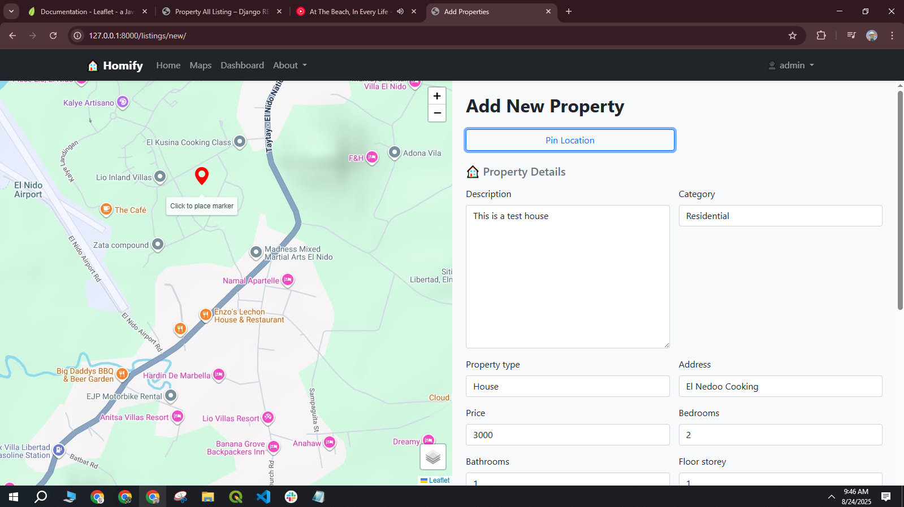

# HOMIFY

This is a webgis project with total CRUD (Create, Read, Update, Delete) Features for the potential sellers to list their properties so that is visible to the potential buyers

---

## Features
- Log-Ins/Signup
- Homepage (News, Updates, Testimony)
- Multiple Basemaps 
- General Map Listing
- User Dashboard (Add, Edit, Delete)
- API ready using rest-django

---

## Screenshots

---

## Tech Stack
- Python 3 / Django 45
- JavaScript / Leaflet
- HTML / CSS / Bootstrap
- PostGIS

---

## Installation / Setup
1. Navigate to the folder: `cd homify`
2. Install dependencies: `pip install -r requirements.txt`
3. Update Schma: `python manage.py makemigrations`
4. Update teh database: `python manage.py migrate`
5. Run the project: `python manage.py runserver`

---

## License
MIT

